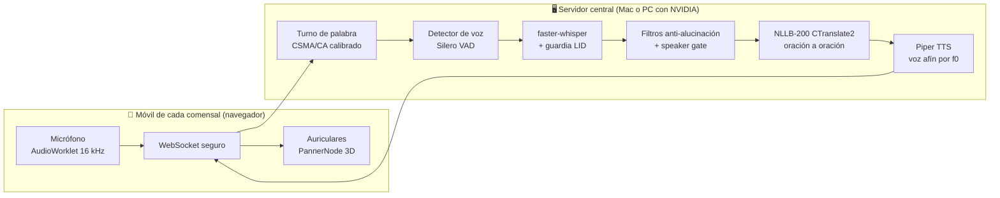

<p align="center">
  <h1 align="center">TradIon — Traducción Simultánea Local con IA</h1>
</p>

<p align="center">
  
  
  
  
  
</p>

**TradIon** convierte una mesa física en una mesa multilingüe: cada persona habla en su idioma a su propio móvil y escucha a los demás **traducidos, con una voz afín a la de cada hablante y sonando desde el sitio real donde está sentado** (audio 3D). Todo el procesamiento —reconocimiento, traducción y síntesis de voz— ocurre en **un único ordenador de la casa**: sin nubes, sin cuotas, sin instalar apps (los móviles entran por el navegador).

Idiomas soportados: **Español · 한국어 · English** (matriz completa, cualquier dirección).

---

## ✨ Qué hace (funcionalidades)

| Funcionalidad | En qué consiste |
| :--- | :--- |
| **Traducción de voz en tiempo real** | Frase cerrada → traducida y hablada en ~**0,5-1,5 s** (RTX 3070) o ~1,5-4 s (MacBook M3), medidos en sesiones reales. |
| **Subtítulos en vivo** | Ves la transcripción crecer *mientras* la persona habla (modelo dedicado que jamás compite con las traducciones). |
| **Turno de palabra automático** | Un árbitro tipo walkie-talkie (CSMA/CA) decide qué micrófono emite, **calibrado por dispositivo**: cada micro compite relativo a su propio nivel de voz, así un móvil con micrófono sensible no roba el canal. Con histéresis, anti-acaparamiento y autocorrección de robos. |
| **Anti cross-captura** | Si tu micro capta la voz del vecino, una guardia de idioma (LID con salvaguardas) la descarta y devuelve el canal; un verificador de locutor (huella del enroll) registra telemetría por segmento. |
| **Voz afín por idioma** | En la calibración se mide tu tono (f0) y se te asigna la voz del catálogo más parecida **para cada idioma destino** — la escuchas y la cambias antes de entrar. Clonación Zero-Shot real (F5-TTS) disponible como modo calidad opcional. |
| **Audio 3D colaborativo** | Plano de la mesa arrastrable y **compartido**: cualquiera recoloca a cualquiera y la voz de cada persona suena desde su asiento (HRTF). Requiere auriculares (idealmente de cable). |
| **Calibración validada por voz** | El enroll te pide leer frases y las valida por reconocimiento (tolerante a acentos); de ahí salen tu huella vocal, tu tono y el nivel de tu micro. |
| **Reconexiones invisibles** | Un micro-corte de red reconecta en 1-2 s conservando identidad, voz, asiento y subtítulos — la mesa ni se entera. |
| **Interfaz trilingüe** | Toda la UI en es/ko/en, con estado honesto en pantalla: quién tiene el turno, por qué no te oyen, micro silenciado. |
| **Arranque sin internet** | Tras la primera descarga de modelos, el servidor arranca y funciona 100 % offline. |
| **Diagnóstico de audio 3D** | Página `/static/diag.html` para medir en 2 minutos qué puede dar cada móvil + auriculares (estéreo real, firma Bluetooth HFP, prueba de oído). |

## 🧠 Cómo funciona



1. **Captura**: tu móvil re-muestrea el micrófono a 16 kHz y lo envía por WebSocket seguro. Empiezas silenciado (como Zoom).
2. **Turno**: el primer micro con voz franca *relativa a su propia calibración* toma el canal; los demás se silencian en el servidor (así tu eco en el móvil de enfrente no genera duplicados). El turno se libera a los 600 ms de silencio.
3. **Segmentación**: un detector neuronal de voz corta tus frases con contexto (pre-roll) y sin trocear pausas naturales.
4. **Transcripción**: `faster-whisper` con una **guardia de idioma**: si detecta con confianza alta otro idioma *de la sala* en tu micro, es la voz del vecino y se descarta (dos seguidas devuelven además el canal); si duda (acentos), re-transcribe forzando tu idioma — nunca pierde tu voz.
5. **Filtros**: confianza, lista negra de alucinaciones, anti-degeneración, y un **verificador de locutor** que compara cada segmento con tu huella del enroll (en modo telemetría hasta calibrarse con las voces reales de tu mesa).
6. **Traducción**: NLLB-200 (int8) **oración a oración**, con topes anti-alucinación y recorte de diálogos inventados.
7. **Síntesis**: Piper genera la voz asignada a tu tono en <150 ms (pre-calentada al calibrar).
8. **Reproducción 3D**: cada oyente recibe subtítulo + traducción a su idioma + audio, que suena desde el asiento real del hablante (mesa hexagonal arrastrable y sincronizada para todos).

**Privacidad por diseño**: la huella vocal vive en RAM y en un WAV temporal que se purga al salir y se barre al arrancar; nada sale de tu red local.

---

## 🛠 Instalación (paso a paso)

Los móviles acceden por navegador — **sin instalar ninguna app**.

### 1. Certificados de red (requisito de los navegadores)
Los navegadores móviles exigen HTTPS para encender el micrófono. Instala `mkcert` a nivel de sistema:
- **Mac:** `brew install mkcert`
- **Windows:** `winget install mkcert`
> ⚠️ Tras instalar, cierra la consola y abre una nueva.

### 2. Clonar y crear el entorno virtual

```bash
git clone https://github.com/pttb6dhg24-tech/TradIon.git
cd TradIon
python -m venv .venv

# Mac (zsh/bash):
source .venv/bin/activate
# Windows (CMD/PowerShell):
.venv\Scripts\activate

pip install -r requirements.txt
```

### 3. Generar los certificados locales

> [!IMPORTANT]
> **Incluye la IP local de tu ordenador** en el certificado: sin ella, los móviles verán un candado inválido y no podrán encender el micrófono. Averíguala con `ipconfig getifaddr en0` (Mac) o `ipconfig` (Windows, campo IPv4).

```bash
mkcert -install
# Sustituye 192.168.1.50 por TU IP local:
mkcert -cert-file config/certs/tradion.pem -key-file config/certs/tradion-key.pem localhost 127.0.0.1 ::1 192.168.1.50
```

Instala además la CA raíz de mkcert en cada móvil (`mkcert -CAROOT` te dice dónde está el `rootCA.pem`).

> [!CAUTION]
> **Los certificados son secretos y NUNCA deben subirse al repositorio** (el `.gitignore` ya veta `config/certs/` entero). Si una clave privada llega a commitearse alguna vez, bórrala **y además regenera los certificados** — eliminar el fichero no lo saca del historial de git.

### 4. Elegir la configuración de tu hardware
Copia la plantilla de tu sistema como configuración activa:
- **Mac (Apple Silicon):** `cp config/settings.mac.yaml config/settings.yaml`
- **Windows (NVIDIA):** `Copy-Item config\settings.windows.yaml config\settings.yaml`

> [!WARNING]
> **Windows (NVIDIA):** para que CUDA encuentre sus librerías:
> ```cmd
> pip install nvidia-cublas-cu12 nvidia-cudnn-cu12
> copy .venv\Lib\site-packages\nvidia\cublas\bin\*.dll .venv\Scripts\
> copy .venv\Lib\site-packages\nvidia\cudnn\bin\*.dll .venv\Scripts\
> ```

### 5. Descargar el catálogo de voces

```bash
# Mac / Linux:
bash scripts/setup_voices.sh

# Windows (mismo resultado, sin bash):
python -m piper.download_voices --data-dir models/piper es_ES-davefx-medium es_ES-carlfm-x_low es_ES-sharvard-medium es_MX-claude-high es_MX-ald-medium en_US-amy-medium en_US-ryan-high en_US-lessac-medium en_GB-alan-medium ko_KR-kss-medium
```

### 6. (Opcional) Verificador de locutor — Speaker Gate

```bash
pip install sherpa-onnx
python scripts/setup_speaker_gate.py
python scripts/bench_speaker_gate.py
```

El benchmark sin argumentos necesita las previews del catálogo, que se generan en el **primer arranque del servidor** (paso 7): ejecútalo después de haber arrancado una vez.

Cada plantilla lo entrega de forma distinta: en **Mac** viene apagado (`enabled: false`); en **Windows** viene **activo y en `enforce: true`** —descarta solo los segmentos claramente ajenos (por debajo de `reject`, 0.35); la zona gris [0.35, 0.55) pasa igualmente— con los umbrales calibrados en sesiones reales (voz propia 0.44-0.77, TTS del dispositivo vecino ≤0.33). Para estrenarlo en otra mesa, ponlo en `enforce: false` (**modo sombra**: solo telemetría en los logs, jamás descarta), recoge una sesión y calibra con dos voces reales de tu mesa (`python scripts/bench_speaker_gate.py voz1.wav voz2.wav`) antes de volver a activarlo.

### 7. Arrancar el servidor

```bash
python -m backend.main_server
```

La primera vez descargará los modelos de IA a `models/` (varios minutos). Después, **arranca y funciona sin internet**.

---

## 🔄 Actualizar el servidor (Windows / PowerShell)

En esa máquina la **fuente de verdad** de la configuración activa es la plantilla `config\settings.windows.yaml`; `config\settings.yaml` es solo la copia de trabajo que sale de ella. Como `settings.yaml` **también está versionado** —y lo que viaja en el repo es la variante del Mac—, tu copia local figura siempre como modificada: descártala **antes** del pull y regenérala después.

```powershell
git restore config/settings.yaml
git pull
Copy-Item config\settings.windows.yaml config\settings.yaml -Force
```

> [!WARNING]
> Si haces el `git pull` sin descartar antes `settings.yaml`, git **aborta la actualización** en cuanto el commit entrante toque ese fichero (`error: Your local changes to the following files would be overwritten by merge`) y el servidor se queda en la versión vieja. Y como el `Copy-Item -Force` lo sobrescribe, cualquier ajuste que quieras conservar en esta máquina va en `config\settings.windows.yaml` (y se commitea), **nunca solo en `settings.yaml`**. Con git anterior a 2.23: `git checkout -- config/settings.yaml`.

> 💡 PowerShell 5.1 no acepta `&&` para encadenar comandos: ejecútalos en líneas separadas (o con `;`). Tras actualizar, los móviles deben recargar la página una vez (el servidor ya sirve el frontend con `no-cache`, pero la primera recarga tras una versión antigua puede necesitar cerrar y reabrir la pestaña).

Si la actualización trae cambios del **Speaker Gate** (paso 6), asegura el modelo y recalibra desde PowerShell:

```powershell
pip install sherpa-onnx
python scripts/setup_speaker_gate.py
python scripts/bench_speaker_gate.py
```

---

## 🌐 Conectividad

### A) Modo recomendado: WiFi local (offline absoluto)
Máxima privacidad, mínima latencia, cero cortes. Solo necesitas que móviles y servidor compartan WiFi.

1. **Windows**: permite el puerto en el firewall (una vez, como Administrador, con el WiFi marcado como red "Privada"):
   ```powershell
   netsh advfirewall firewall add rule name="TradIon 8443" dir=in action=allow protocol=TCP localport=8443 profile=private remoteip=localsubnet
   ```
2. Arranca el servidor y entra desde los móviles en `https://<IP-DE-TU-ORDENADOR>:8443`.

### B) Túnel de Cloudflare (solo pruebas puntuales)

```bash
cloudflared tunnel --url https://localhost:8443 --no-tls-verify
```

> [!CAUTION]
> **El enlace del túnel NO es privado y la mesa no tiene autenticación**: cualquiera con la URL entra, escucha las traducciones y deja muestra de su voz. Además, el túnel corta los WebSockets con timeouts de ~100 s y añade 50-200 ms de latencia. Úsalo solo para pruebas breves con gente de confianza; para uso real, WiFi local.

---

## 🎧 Recomendaciones de audio (importan más que cualquier ajuste)

- **Auriculares de cable** para el 3D completo: el HRTF es binaural y por el altavoz del móvil es físicamente imposible.
- **Bluetooth**: vale para *escuchar*, pero **su micrófono no** — con el micro activo, iOS/Android conmutan al perfil de telefonía (mono, banda estrecha) y el reconocimiento se degrada gravemente (comprobado en sesiones reales). Usa el micro del propio móvil.
- Cada móvil cerca de su dueño; habla claro y deja que la frase termine (el turno se libera a los 600 ms de silencio).
- Ante cualquier duda, abre `https://<IP>:8443/static/diag.html` en el móvil: mide tu ruta de audio real y te dice qué puede dar.

## ⚙️ Configuración

Toda la configuración vive en `config/settings.yaml` (nada hardcodeado). Las claves más útiles:

| Clave | Qué controla |
| :--- | :--- |
| `stt.model_size` / `device` | Modelo Whisper y CPU/CUDA (plantillas ya afinadas por hardware). |
| `audio.segment_close_silence_ms` | Silencio que cierra una frase (600 ms: equilibrio frases completas/latencia). |
| `room.floor.*` | El turno de palabra: umbrales relativos, contienda, anti-acaparamiento. |
| `stt.lid_crosstalk_min_prob` | Confianza mínima para descartar voz ajena por idioma. |
| `stt.speaker_gate.*` | Verificador de locutor (sombra/enforce, umbrales). |
| `tts.backend` | `piper` (rápido, por defecto) o `f5tts` (clonación real, más lento). |

## 🧩 Estructura del repositorio

```
backend/    servidor aiohttp, motores (core_engine, translation, tts, speaker_gate)
frontend/   PWA vanilla: lobby, mesa, audio-worklet, diagnóstico 3D
config/     settings.yaml + plantillas por hardware (certs/ NUNCA se versiona)
scripts/    descarga de voces, speaker gate, benchmarks, MeCab coreano
models/     pesos de IA (se descargan; fuera del repo)
docs/       DOCUMENTO_MAESTRO.md — arquitectura, decisiones y diario de ingeniería
```

## 🗺️ Hoja de ruta

- **F12 — "Tela de araña"**: anillos de distancia en el plano 3D + filtro de "aire" con la lejanía + modos Sutil/Inmersivo.
- **Speaker gate en enforce** tras calibración con las voces reales de cada mesa.
- PIN de sala para exposición fuera de la LAN.

---

## ⚖️ Licencia y uso comercial (double licensing)

El código fuente de este repositorio (arquitectura TradIon, algoritmos de red y código del servidor) se publica bajo licencia **MIT**, permitiendo explícitamente su uso y explotación comercial.

> [!CAUTION]
> **Aviso para uso comercial:**
> Por defecto, la configuración descarga y usa el modelo **NLLB-200** (Meta), protegido bajo licencia **CC-BY-NC-4.0**, que **PROHÍBE ESTRICTAMENTE SU USO COMERCIAL**.
>
> Si pretendes usar TradIon en un producto de pago o cualquier actividad con ánimo de lucro, **DEBES sustituir en `config/settings.yaml` el modelo NLLB por un modelo de traducción de licencia abierta o una API comercial** (p. ej. DeepL). El autor de TradIon no asume responsabilidad por el uso indebido de los pesos de Meta por terceros.
